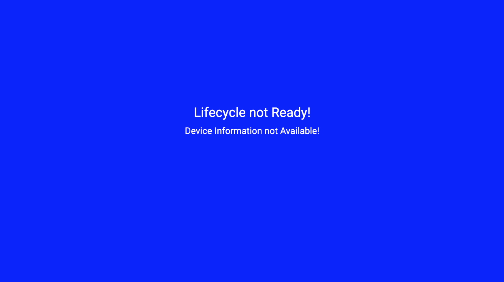
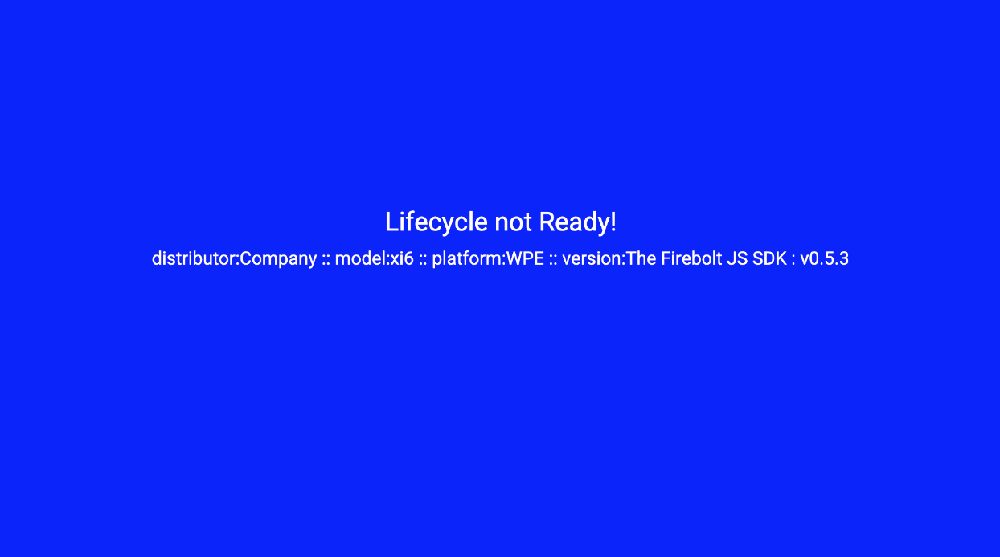
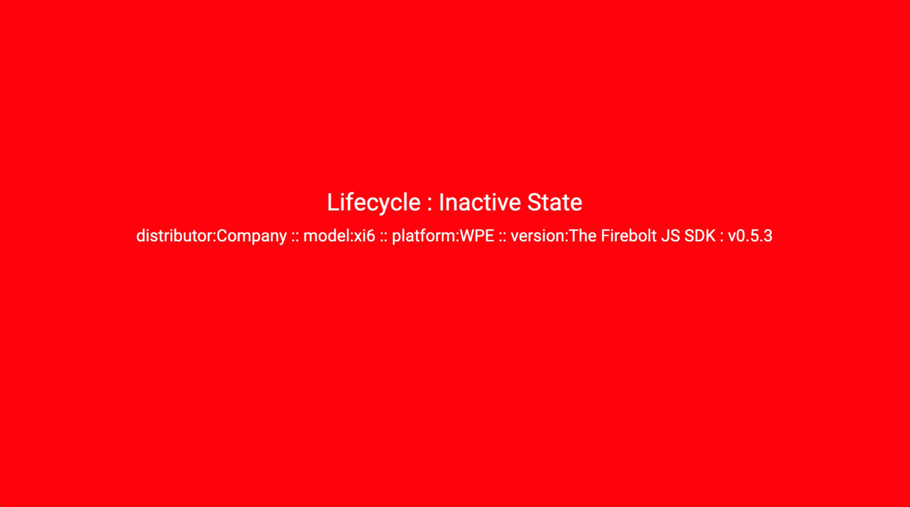
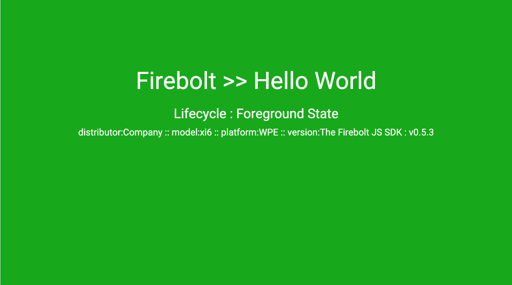

# Welcome

In this guide you'll learn how to get up and running to so you can build a simple single page app using the Firebolt SDK. It will show you the fundamentals like importing modules and how to use the Firebolt Device and Lifecycle modules.

---
# Overview
What you will learn :-
- Building a Basic Firebolt Single Page Application
- Importing Firebolt modules
- Registering Firebolt Events for Lifecycle & Device 
- Running the application with Mock Firebolt 

---
# Tools
Please refer to firebolt API documentation as provided by your platform distributor.

This guide is built using the JavaScript framework Lightning. Whilst no prior knowledge of Lightning is required, you can find further information in the below link:- 

> https://lightningjs.io/docs/#/getting-started/index

---
# Getting started

> Clone this repo 

```console
git clone https://github.com/rdkcentral/firebolt-hello-world.git
```

> cd to the starting application

```console
cd pt1-firebolt_hello_world-start
```

> install

```console
npm install
```
> build & run in browser

```console
npm run build & npm run dev
```

> opening in browser ->



<br>

# Install the Firebolt SDK
```
npm install @firebolt-js/sdk
```

> build and automatically open local browser
```
npm run build & npm run dev
```


# Importing Firebolt Modules
Going to leveraging the Following APIs: 
- [Lifecycle](https://developer.comcast.com/firebolt/core/sdk/latest/docs/lifecycle-management/)  
- [Discovery](https://developer.comcast.com/firebolt/core/sdk/latest/docs/lifecycle-management/) 

in `src/App.js`
import the following modules
```
import { Lifecycle, Device } from '@firebolt-js/sdk';
```

# Firebolt Device Module
modify the `_active()` function to include the following code.

This will append the `Device` text field with appropriate `Firebolt Device`  information

```
Device.distributor()
.then(distributor => {
  const deviceDistributor = 'distributor:' + distributor;
  this.tag('Device').text.text = deviceDistributor + ' :: '; 
});

Device.model()
.then(model => {
  const deviceModel = 'model:' + model;
  this.tag('Device').text.text += deviceModel + ' :: '; 
});

Device.platform()
.then(platform => {
  const devicePlatform = 'platform:' + platform;
  this.tag('Device').text.text += devicePlatform + ' :: '; 
});

Device.version()
.then(version => {
  const deviceVersion = 'version:' + version.sdk.readable + ' : v' + version.sdk.major + '.' + version.sdk.minor + '.' + version.sdk.patch;
  this.tag('Device').text.text += deviceVersion; 
});  
```

refreshing the browser you should now see ->



> Note: As we are using a desktop browser this information being displayed is via the mock transport layer provided in the SDK

> When running on a Firebolt device or when using the Mock Firebolt application, this information will represent those environments.


# Firebolt Lifecycle: Listening to Events
We will now add Lifecycle event listeners to respond to the Lifecycle states.
For more information on listening to events please refer to the API documentation
> https://developer.comcast.com/firebolt/core/sdk/latest/docs/listening-for-events/

add the following function at the same level as the `_active()` function .

```
_registerLifecycleCallbacks() {
  Lifecycle.listen((event, value) => {
    console.log('Lifecycle.listen:', event, value);

    if (value.state) {
      console.log('Lifecycle: >> : previous state :' + value.previous, value);
      console.log('Lifecycle: >> : current state :' + value.state, value);
    }

    if (value.state == 'foreground') {
      console.log('Lifecycle : Foreground State');
      this.tag('HelloWorld').color = LifecycleColors.FOREGROUND;
      this.tag('Lifecycle').text.text = 'Lifecycle : Foreground State';
      this.tag('Complete').visible = true;
    }
    if (value.state == 'inactive') {
      console.log('Lifecycle : Inactive State');
      this.tag('HelloWorld').color = LifecycleColors.INACTIVE;
      this.tag('Lifecycle').text.text = 'Lifecycle : Inactive State';
    }
    if (value.state == 'background') {
      console.log('Lifecycle : Background State');
      this.tag('HelloWorld').color = LifecycleColors.BACKGROUND;
      this.tag('Lifecycle').text.text = 'Lifecycle : Background State';
    }
  });
}
```


By now adding the following code within the `_active()` function we will register the events and inform Firebolt we are 'Lifecycle.ready'

```
this._registerLifecycleCallbacks();
Lifecycle.ready();
```    

refreshing the bowser you should now see ->

> The Lifecycle state and background color change to reflect the transitions to the 'Foreground' state





# Wrapping Up
You can see the Final Project in this repo in the folder :-
```console
pt2-firebolt_hello_world-complete
```

# Using with the Mock Firebolt Server
As previously mentioned

> When running a desktop browser the interaction with Firebolt is via the mock transport layer provided in the SDK.

> When running on a Firebolt device or when using the Mock Firebolt Server, this interaction will represent those environments.

To use Mock Firebolt please refer to the installation guide here:
```console
https://github.com/rdkcentral/mock-firebolt
```

You can find the Hello World application with additional support for Mock Firebolt  here :-
```console
pt3-firebolt_hello_world-mock
```

Using the mock Firebolt server is achieved by passing 'mf=true' via the query string to your running version of Hello World
```
http://localhost:8080/?mf=true
```

To use the Mock Firebolt in your own project in a similar manner, insert the following  `activateMockFirebolt.js` script from the above git repo.

# Complete
